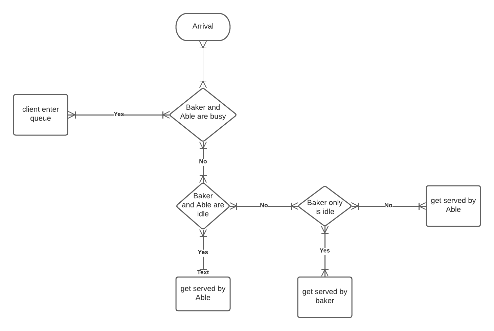
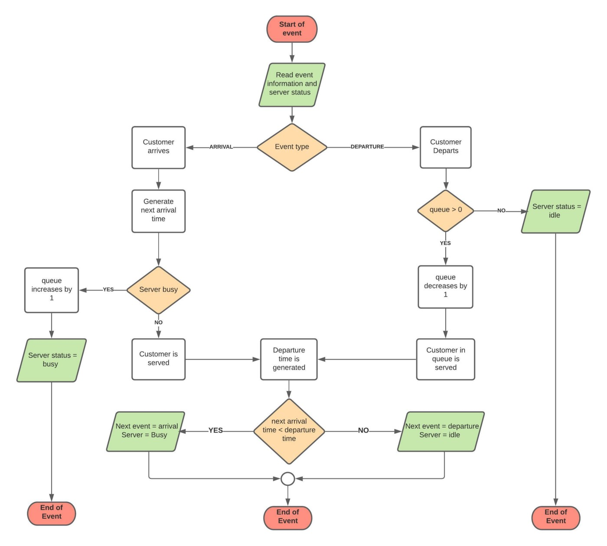

# Multi Servers Queuing Simulation

flow chart explains the process of clients entering multi servers queuing sytem



```python
import numpy as np
import pandas as pd
import warnings
warnings.filterwarnings('ignore')

class CenterSimulation:
    def __init__(self): 
        self.clock=0.0                      #simulation clock
        self.num_arrivals=0                 #total number of arrivals
        self.t_arrival=self.gen_int_arr()   #time of next arrival
        self.t_departure_baker=float('inf')      #departure time from baker
        self.t_departure_able=float('inf')      #departure time from able
        self.dep_sum_baker=0                     #Sum of service times by baker
        self.dep_sum_able=0                     #Sum of service times by able
        self.baker_state=0                     #current state of baker
        self.able_state=0                     #current state of able
        self.total_wait_time=0.0            #total wait time
        self.num_in_q=0                     #current number in queue
        self.number_in_queue=0              #customers who had to wait in line(counter)
        self.num_of_departures_baker=0           #number of customers served by baker
        self.num_of_departures_able=0           #number of customers served by able
        self.num_in_system=0
        
    def time_adv(self):                                                       
        t_next_event=min(self.t_arrival,self.t_departure_baker,self.t_departure_able)  
        self.total_wait_time += (self.num_in_q*(t_next_event-self.clock))
        self.clock=t_next_event
                
        if self.t_arrival<self.t_departure_baker and self.t_arrival<self.t_departure_able:
            self.arrival()
        elif self.t_departure_baker<self.t_arrival and self.t_departure_baker<self.t_departure_able:
            self.baker()
        else:
            self.able()
            
    def arrival(self):              
        self.num_arrivals += 1
        self.num_in_system += 1

        if self.baker_state==1 and self.able_state==1:
            self.num_in_q+=1
            self.number_in_queue+=1
            self.t_arrival=self.clock+self.gen_int_arr()


        elif self.baker_state==0 and self.able_state==0:
            self.able_state=1
            self.dep2= self.gen_service_time_able()
            self.dep_sum_able += self.dep2
            self.t_departure_able=self.clock + self.dep2
            self.t_arrival=self.clock+self.gen_int_arr()


        elif self.baker_state==0 and self.able_state ==1:       #if able is busy customer goes to Baker
            self.dep1= self.gen_service_time_baker()
            self.dep_sum_baker += self.dep1
            self.t_departure_baker=self.clock + self.dep1
            self.t_arrival=self.clock+self.gen_int_arr()
            self.baker_state=1
        else:                                              #otherwise customer goes to Able
            self.dep2= self.gen_service_time_able()
            self.dep_sum_able += self.dep2
            self.t_departure_able=self.clock + self.dep2
            self.t_arrival=self.clock+self.gen_int_arr()
            self.able_state=1


                
    def baker(self):                #departure from Baker
        self.num_of_departures_baker += 1
        if self.num_in_q>0:
            self.dep1= self.gen_service_time_baker()
            self.dep_sum_baker += self.dep1
            self.t_departure_baker=self.clock + self.dep1
            self.num_in_q-=1
        else:
            self.t_departure_baker=float('inf') 
            self.baker_state=0                  
    
    def able(self):                #departure from Able
        self.num_of_departures_able += 1
        if self.num_in_q>0:
            self.dep2= self.gen_service_time_able()
            self.dep_sum_able += self.dep2
            self.t_departure_able=self.clock + self.dep2
            self.num_in_q-=1
        else:
            self.t_departure_able=float('inf')
            self.able_state=0
            
            
    def gen_int_arr(self):                                             #function to generate arrival times using inverse trnasform
        return (-np.log(1-(np.random.uniform(low=0.0,high=1.0))) * 3)
    
    def gen_service_time_baker(self):                                #function to generate service time for teller 1 using inverse trnasform (Baker is slower from Able so he takes longer service times)
        return (-np.log(1-(np.random.uniform(low=0.0,high=1.0))) * 2)
    
    def gen_service_time_able(self):                                #function to generate service time for teller 1 using inverse trnasform
        return (-np.log(1-(np.random.uniform(low=0.0,high=1.0))) * 1.1)
    

s=CenterSimulation()
df=pd.DataFrame(columns=['Average interarrival time','Average service time baker','Average service time Able','Utilization Baker','Utilization Able','People who had to wait in line','Total average wait time'])


for i in range(100):
    np.random.seed(i)
    s.__init__()
    while s.clock <= 240 :
        s.time_adv() 
    a=pd.Series([s.clock/s.num_arrivals,s.dep_sum_baker/s.num_of_departures_baker,s.dep_sum_able/s.num_of_departures_able,s.dep_sum_baker/s.clock,s.dep_sum_able/s.clock,s.number_in_queue,s.total_wait_time],index=df.columns)
    df=df.append(a,ignore_index=True)   
    


df
```


<div>
<style scoped>
    .dataframe tbody tr th:only-of-type {
        vertical-align: middle;
    }

    .dataframe tbody tr th {
        vertical-align: top;
    }

    .dataframe thead th {
        text-align: right;
    }
</style>
<table border="1" class="dataframe">
  <thead>
    <tr style="text-align: right;">
      <th></th>
      <th>Average interarrival time</th>
      <th>Average service time baker</th>
      <th>Average service time Able</th>
      <th>Utilization Baker</th>
      <th>Utilization Able</th>
      <th>People who had to wait in line</th>
      <th>Total average wait time</th>
    </tr>
  </thead>
  <tbody>
    <tr>
      <th>0</th>
      <td>3.354362</td>
      <td>1.715341</td>
      <td>0.896484</td>
      <td>0.085229</td>
      <td>0.222716</td>
      <td>3.0</td>
      <td>2.286931</td>
    </tr>
    <tr>
      <th>1</th>
      <td>2.559649</td>
      <td>1.803057</td>
      <td>1.279163</td>
      <td>0.239801</td>
      <td>0.329617</td>
      <td>14.0</td>
      <td>15.453538</td>
    </tr>
    <tr>
      <th>2</th>
      <td>2.735391</td>
      <td>1.060246</td>
      <td>0.908162</td>
      <td>0.088092</td>
      <td>0.256549</td>
      <td>2.0</td>
      <td>0.063974</td>
    </tr>
    <tr>
      <th>3</th>
      <td>2.897822</td>
      <td>1.584024</td>
      <td>1.038088</td>
      <td>0.091104</td>
      <td>0.294261</td>
      <td>4.0</td>
      <td>4.380135</td>
    </tr>
    <tr>
      <th>4</th>
      <td>3.098845</td>
      <td>2.634542</td>
      <td>1.167375</td>
      <td>0.174394</td>
      <td>0.294609</td>
      <td>8.0</td>
      <td>8.421442</td>
    </tr>
    <tr>
      <th>...</th>
      <td>...</td>
      <td>...</td>
      <td>...</td>
      <td>...</td>
      <td>...</td>
      <td>...</td>
      <td>...</td>
    </tr>
    <tr>
      <th>95</th>
      <td>3.046365</td>
      <td>2.053214</td>
      <td>1.183032</td>
      <td>0.168497</td>
      <td>0.286402</td>
      <td>9.0</td>
      <td>7.362459</td>
    </tr>
    <tr>
      <th>96</th>
      <td>2.869316</td>
      <td>2.318782</td>
      <td>1.255635</td>
      <td>0.221274</td>
      <td>0.312577</td>
      <td>5.0</td>
      <td>3.567587</td>
    </tr>
    <tr>
      <th>97</th>
      <td>2.847879</td>
      <td>2.162364</td>
      <td>1.431722</td>
      <td>0.22332</td>
      <td>0.348956</td>
      <td>17.0</td>
      <td>21.916398</td>
    </tr>
    <tr>
      <th>98</th>
      <td>3.255123</td>
      <td>2.189673</td>
      <td>1.012438</td>
      <td>0.109084</td>
      <td>0.252186</td>
      <td>0.0</td>
      <td>0.0</td>
    </tr>
    <tr>
      <th>99</th>
      <td>3.430319</td>
      <td>2.932002</td>
      <td>0.837767</td>
      <td>0.122104</td>
      <td>0.202357</td>
      <td>0.0</td>
      <td>0.0</td>
    </tr>
  </tbody>
</table>
<p>100 rows × 7 columns</p>
</div>


# Single Server Queuing Simulation

this flow chart show depicts the code below for single server simulation 



```python
import numpy as np
import pandas as pd
import warnings
warnings.filterwarnings('ignore')

class CenterSimulation:
    def __init__(self): 
        self.clock=0.0                      #simulation clock
        self.num_arrivals=0                 #total number of arrivals
        self.t_arrival=self.gen_int_arr()   #time of next arrival
        self.t_departure_baker=float('inf')      #departure time from baker
        self.dep_sum_baker=0                     #Sum of service times by baker
        self.baker_state=0                     #current state of baker
        self.total_wait_time=0.0            #total wait time
        self.num_in_q=0                     #current number in queue
        self.number_in_queue=0              #customers who had to wait in line(counter)
        self.num_of_departures_baker=0           #number of customers served by baker
        self.num_in_system=0
        
    def time_adv(self):                                                       
        t_next_event=min(self.t_arrival,self.t_departure_baker)  
        self.total_wait_time += (self.num_in_q*(t_next_event-self.clock))
        self.clock=t_next_event
                
        if self.t_arrival<self.t_departure_baker:
            self.arrival()
        else:
            self.baker()

            
    def arrival(self):              
        self.num_arrivals += 1
        self.num_in_system += 1

        if self.baker_state==1:                    #if baker is busy people will wait in the queue
            self.num_in_q+=1
            self.number_in_queue+=1
            self.t_arrival=self.clock+self.gen_int_arr()


        else:                                                     # if baker is idle client will get served
            self.dep1= self.gen_service_time_baker()
            self.dep_sum_baker += self.dep1
            self.t_departure_baker=self.clock + self.dep1
            self.t_arrival=self.clock+self.gen_int_arr()
            self.baker_state=1

  
    def baker(self):                #departure from Baker
        self.num_of_departures_baker += 1
        if self.num_in_q>0:
            self.dep1= self.gen_service_time_baker()
            self.dep_sum_baker += self.dep1
            self.t_departure_baker=self.clock + self.dep1
            self.num_in_q-=1
        else:
            self.t_departure_baker=float('inf') 
            self.baker_state=0                          
            
    def gen_int_arr(self):                                             #function to generate arrival times using inverse trnasform
        return (-np.log(1-(np.random.uniform(low=0.0,high=1.0))) * 3)
    
    def gen_service_time_baker(self):                                #function to generate service time for teller 1 using inverse trnasform (Baker is slower from Able so he takes longer service times)
        return (-np.log(1-(np.random.uniform(low=0.0,high=1.0))) * 1.9)
    

s=CenterSimulation()
df1=pd.DataFrame(columns=['Average interarrival time','Average service time baker','Utilization Baker','People who had to wait in line','Total average wait time'])


for i in range(100):
    np.random.seed(i)
    s.__init__()
    while s.clock <= 240 :
        s.time_adv() 
    a=pd.Series([s.clock/s.num_arrivals,s.dep_sum_baker/s.num_of_departures_baker,s.dep_sum_baker/s.clock,s.number_in_queue,s.total_wait_time],index=df1.columns)
    df1=df1.append(a,ignore_index=True)   
    


df1
```


<div>
<style scoped>
    .dataframe tbody tr th:only-of-type {
        vertical-align: middle;
    }

    .dataframe tbody tr th {
        vertical-align: top;
    }

    .dataframe thead th {
        text-align: right;
    }
</style>
<table border="1" class="dataframe">
  <thead>
    <tr style="text-align: right;">
      <th></th>
      <th>Average interarrival time</th>
      <th>Average service time baker</th>
      <th>Utilization Baker</th>
      <th>People who had to wait in line</th>
      <th>Total average wait time</th>
    </tr>
  </thead>
  <tbody>
    <tr>
      <th>0</th>
      <td>2.763047</td>
      <td>2.085618</td>
      <td>0.746149</td>
      <td>60.0</td>
      <td>406.421307</td>
    </tr>
    <tr>
      <th>1</th>
      <td>2.756512</td>
      <td>2.004849</td>
      <td>0.719049</td>
      <td>65.0</td>
      <td>291.705469</td>
    </tr>
    <tr>
      <th>2</th>
      <td>2.613436</td>
      <td>1.620619</td>
      <td>0.61337</td>
      <td>56.0</td>
      <td>193.642664</td>
    </tr>
    <tr>
      <th>3</th>
      <td>3.000098</td>
      <td>1.626379</td>
      <td>0.535332</td>
      <td>34.0</td>
      <td>65.900818</td>
    </tr>
    <tr>
      <th>4</th>
      <td>3.302136</td>
      <td>1.889679</td>
      <td>0.540903</td>
      <td>40.0</td>
      <td>147.860943</td>
    </tr>
    <tr>
      <th>...</th>
      <td>...</td>
      <td>...</td>
      <td>...</td>
      <td>...</td>
      <td>...</td>
    </tr>
    <tr>
      <th>95</th>
      <td>2.739194</td>
      <td>2.230209</td>
      <td>0.767924</td>
      <td>70.0</td>
      <td>479.933206</td>
    </tr>
    <tr>
      <th>96</th>
      <td>2.581032</td>
      <td>2.31113</td>
      <td>0.885903</td>
      <td>81.0</td>
      <td>601.892088</td>
    </tr>
    <tr>
      <th>97</th>
      <td>3.327429</td>
      <td>2.100141</td>
      <td>0.622514</td>
      <td>50.0</td>
      <td>264.376443</td>
    </tr>
    <tr>
      <th>98</th>
      <td>3.060466</td>
      <td>1.839961</td>
      <td>0.593593</td>
      <td>53.0</td>
      <td>222.680624</td>
    </tr>
    <tr>
      <th>99</th>
      <td>3.438116</td>
      <td>1.641855</td>
      <td>0.470819</td>
      <td>33.0</td>
      <td>79.073377</td>
    </tr>
  </tbody>
</table>
<p>100 rows × 5 columns</p>
</div>


it would be a mess if baker was working alone!
